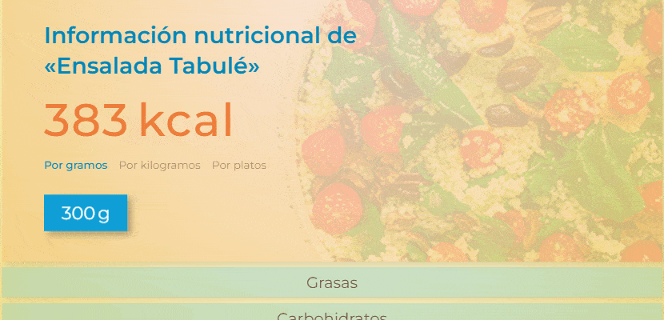
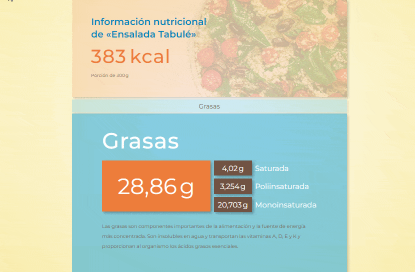
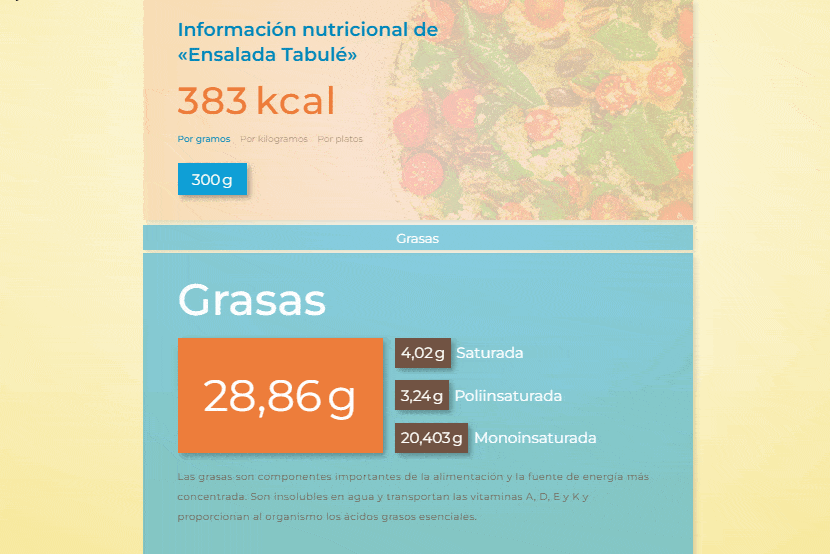
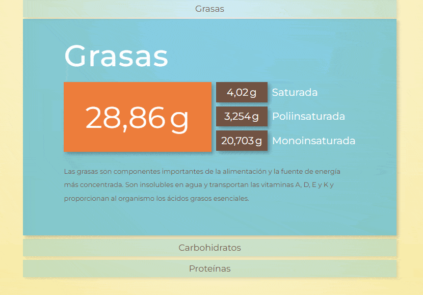
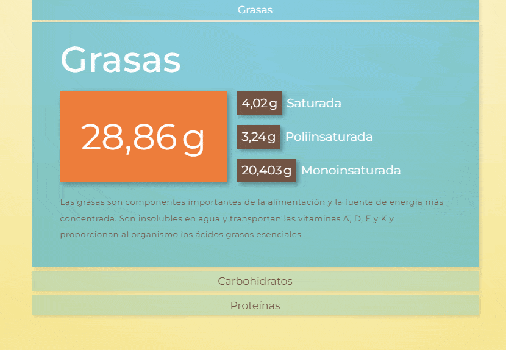

# Mi primer sitio con JavaScript: [Sauce | Restaurante de Tradición][index-page]

En el año 2021 comencé a dar mis primeros pasos en el mundo del desarrollo web aprendiendo las tecnologías y prácticas básicas para desarrollar sitios estáticos. Este proceso de aprendizaje se ve reflejado en lo que es mi [primer proyecto][mi-primer-sitio-repo]. Si no lo conocés, recomiendo que le eches una mirada, aunque sea rápida, para poder tener un mejor contexto de dónde es que viene y el por qué de este nuevo proyecto.

Este es una continuación de aquel primer sitio estático que tanto me ayudó a llevar a la práctica y afianzar los conocimientos de aquellas herramientas que iba estudiando. ¿Cuál es la diferencia? Como habrás notado en el título de esta introducción, ahora dicho sitio está desarrollado con funcionalidades dinámicas gracias a que en el transcurso del año 2022 tuve la oportunidad de comenzar a introducirme en el aprendizaje de JavaScript. Este proceso fue muy parecido al llevado a cabo en la realización de aquel primer proyecto.

Los recursos principales que utilicé para esta introducción a JavaScript fueron, con amplia diferencia, dos: [El tutorial de JavaScript Moderno][js-info] y [*MDN Web Docs*][MDN]. El primero fue una gran hoja de ruta que me guió a través de las múltiples partes fundamentales a incorporar en el proceso de aprendizaje de este lenguaje. A su vez, los contenidos me parecieron extremadamente pedagógicos y de una minuciosidad que no encontré en casi ningún otro recurso disponible para principiantes. Así es que me dio las herramientas necesarias para poder comenzar a entender y llevar a la práctica gran parte de sus características y funcionalidades principales. Por otro lado, el segundo me sirvió como una documentación mucho más técnica que me ayudó a completar el «mapa conceptual» del lenguaje en partes en las cuales [El tutorial de JavaScript Moderno][js-info] no ahondaba debido a su enfoque más pedagógico, recién mencionado, y no tan técnico al estilo documentación como sí lo es [*MDN Web Docs*][MDN].

En fin, en este trayecto comprendí que tenía la suerte haber desarrollado un primer proyecto lo suficientemente grande al cual podía dotarlo de muchísimas funcionalidades a través de JavaScript. Realmente las posibilidades son infinitas. Es así que aproveché esta base que es el proyecto «[Mi primer sitio][mi-primer-sitio-repo]» para refactorizarlo, convirtiéndolo en un sitio web dinámico en cuyo proceso iba a terminar de incorporar gran parte de las características que he ido aprendiendo este último año.

Ahora bien, ¿por qué un sitio web desarrollado con Vanilla JavaScript y no con una librería o *framework* de los que son usados actualmente? La raíz de esta decisión es la misma por la cual desarrollé un primer sitio totalmente estático: el objetivo principal fue estudiar, aprender y entender de la forma más consistente posible las bases del lenguaje de programación JavaScript y su estrecha interrelación con los navegadores web. Una vez comenzado a cumplir este objetivo (JavaScript es gigante, imposible abarcarlo todo en un proyecto de estudio como este) me adentraré en el aprendizaje de una librería o *framework* de desarrollo (muy probablemente [React JS][react]) para así poder dar un paso más en mi camino a convertirme en un desarrollador *front-end*.

A continuación voy a detallar algunas partes de este proyecto para que al momento de explorar el repositorio puedas tener un acercamiento más ameno a sus contenidos.

## Índice de contenidos
+ [Refactorización de componentes](#refactorización-de-componentes)
   + [Nutritional Info](#nutritional-info)
+ [Base de datos con la *API REST* de *My JSON Server*](#base-de-datos-con-la-api-rest-de-my-json-server)
   + [Funcionamiento](#funcionamiento)

## Refactorización de componentes

Como mencioné en la introducción, me encontré en la afortunada situación de tener un primer proyecto como base lo suficientemente grande que me daría la oportunidad de experimentar con él para poder aplicar múltiples funcionalidades a través de JavaScript. Sin embargo, esto no significa que tomé el código estructural del primer proyecto y simplemente le agregué unos cuantos archivos «.js» para dotarlo de dinamismo.

En su lugar, este proceso comenzó con el intento de refactorizar cada parte de aquella estructura propensa a ser mejorada. Esto lo realicé atendiendo a diferentes criterios que tuve la oportunidad de afianzar y comprender con mayor profundidad luego de un año más de estudio. Considero que en el primer proyecto estos criterios fueron, o bien logrados a medias o directamente desatendidos por mi falta de experiencia y práctica.

Alguno de los criterios principales a tener en cuenta en este nuevo proyecto fueron los relacionados a la escalabilidad, lograr una estructura más atomizada e independiente entre cada una de sus partes, ajustar la arquitectura de directorios de Sass a estas nuevas estructuras, corregir ciertas denominaciones de clases basadas en [BEM][bem] para conseguir manipular de forma más óptima el DOM, lograr un código HTML lo más limpio posible de clases innecesarias que dificulten su lectura y entendimiento, entre otros.

Obviamente, estos casos se dan en mayor o menor medida a lo largo de todo el proyecto, desde componentes extremadamente grandes y complejos heredados del primero y posteriormente atomizados e independizados de una forma más óptima en este, hasta otros que casi no necesitaron modificación alguna debido a que su estructura ya se encontraba lo suficientemente optimizada para ser utilizada. Si conocés el proyecto «[Mi primer sitio][mi-primer-sitio-repo]», seguramente al explorar los archivos HTML y CSS/Sass de este nuevo proyecto reconocerás más fácilmente estos cambios y mejoras enumeradas.

A modo de ejemplo, a continuación menciono un caso de refactorización que necesitó abarcar criterios tales como la escalabilidad, la previsibilidad de entrada de datos de gran longitud, adición de nuevas funcionalidades, mejores denominaciones de clases para su manejo tanto en CSS como en JavaScript, entre otros.

### [Nutritional Info][nutritional-info]

+ #### Adición de opciones de cantidad y unidades de peso personalizadas

  En el primer proyecto, el usuario solamente contaba con una información nutricional estática [cada 300 gramos de alimento][info-nutricional-static-grams]. En este nuevo desarrollo se le da la posibilidad de introducir una cantidad numérica personalizada además de poder elegir qué tipo de unidad de peso representa dicha cantidad. En esta instancia se contemplan tres tipos de unidades: gramos, kilogramos y platos (donde cada plato equivale a 300 gramos).
  
  Naturalmente, esta refactorización implicó un aumento de la complejidad del subcomponente [Main][nutritional-info-main] del [Nutritional Info][nutritional-info]. Aun así, se logró mantener su independencia, además de que se prevé un crecimiento futuro del proyecto pudiéndose agregar cuantas opciones de unidades de peso hagan falta, como se puede visualizar en los siguientes ejemplos.
  
  > Animación que muestra el subcomponente Main del Nutritional Info con las nuevas opciones disponibles para el usuario.

  
  
  > Animación que muestra la capacidad del subcomponente Main de albergar cuantas opciones de unidades de peso sean necesarias en caso de necesitar incorporar alguna nueva en el futuro.

  
  
+ #### Soporte para entrada de datos de gran longitud
  
  En el primer proyecto, al tratarse de un desarrollo estático y, por ende, teniendo cierta previsibilidad de los datos a ser presentados, cometí el error de no contemplar la posibilidad de que dichos datos fuesen extremadamente grandes. En consecuencia, esto rompería por completo el diseño y maquetación del componente.
  
  En esta ocasión, al haberle dado la posibilidad al usuario de que decida él mismo la extensión de los datos a ser presentados, me vi obligado a tener presente este escenario que en aquella ocasión fue ignorado. Es así que dichos errores fueron abordados y posteriormente arreglados, dándole la posibilidad al usuario de poder ingresar datos de una longitud arbitraria sin que eso signifique que el componente se vea afectado en su presentación.
  
  > Animación que muestra el componente [Nutritional Info][info-nutricional] en el proyecto «[Mi primer sitio][mi-primer-sitio-repo]» y cómo al forzar la longitud de los datos presentados, se rompe el diseño y la maquetación.
  
  
  
  > Animación que muestra el componente [Nutritional Info][nutritional-info] refactorizado y cómo al forzar la longitud de los datos presentados, el diseño y la maquetación se mantienen.

  
  
   Obviamente, es muy difícil que el usuario tenga un interés genuino en ingresar una cantidad de, por ejemplo, kilogramos tan grande que genere un recuento de calorías y gramos tal que desborde sus contenedores. Aun así, es un caso del que hay que estar prevenido y tratar de manejarlo para evitar errores y renderizados defectuosos.
   
+ #### Posibilidad de ampliar los «ratios» necesarios

  Nuevamente, en el primer proyecto ignoré el escenario en donde el sitio necesitase crecer y en ese proceso ampliar la información de «ratios» que les son presentados al usuario. Al igual que con el soporte para entrada de datos de gran longitud, en esta ocasión dicha posibilidad fue contemplada y posteriormente arreglada, dándole la posibilidad al proyecto de que en un futuro pueda extender estas informaciones sin que el diseño y maquetación del subcomponente [Details][nutritional-info-details] se vea afectada.
  
  > Animación que muestra el subcomponente [Details][info-nutricional-details] en el proyecto «[Mi primer sitio][mi-primer-sitio-repo]» y cómo al ampliar la información de «ratios» presentados al usuario, se rompe el diseño y la maquetación.
  
  
  
  > Animación que muestra el subcomponente [Details][nutritional-info-details] refactorizado y cómo al ampliar la información de «ratios» presentados al usuario, el diseño y la maquetación se mantienen.
  
  
  
## Base de datos con la *API REST* de [*My JSON Server*][json-server]
   
   Como es de esperarse en un sitio construido, al menos en parte, con JavaScript, busqué obtener de forma dinámica los datos de los platos con los que el usuario va a interactuar.
  
   Ya no existe un documento [menu.html][mi-primer-sitio-menu] en el que se encuentra un listado de todos los platos establecidos de antemano. En su lugar, ahora hay un documento [menu.html][menu] que trae los datos desde una base simulada y posteriormente los renderiza según los requerimientos del usuario. Lo mismo ocurre con los documentos individuales de cada plato. En realidad, ya no existen tales documentos preestablecidos en un servidor esperando a ser entregados a un navegador que lo solicite. Ahora todos son manejados desde un único documento [plate.html][plate], que junto a su código JavaScript va renderizando diferentes platos dependiendo de las acciones del usuario. Se podría decir que tiene la misma lógica de funcionamiento que una [*SPA*][spa] dentro del sitio general, ya que una vez en este documento, jamás se realiza una recarga general para volver a renderizar tal o cual plato. En su lugar, solo se actualizan los componentes necesarios para mostrarle al usuario los datos correctos.
   
   Para poder concretar estos requerimientos sin aún poseer conocimientos en la construcción de una base de datos y la programación de su API, me apoyé en la herramienta [*My JSON Server*][json-server]. La elegí porque su uso básico es simple y cubría dichos requerimientos de forma exitosa. Esto me liberó de la tarea de aprender a las apuradas alguna otra herramienta un tanto más compleja para poder cubrir las necesidades del proyecto, desviándome así del objetivo principal que era enfocarme en JavaScript y su interacción con el navegador para renderizar de forma correcta la interfaz de usuario.
   
   ### Funcionamiento
   
   En la raíz del proyecto tuve que crear un JSON llamado [db.json][db]. En su versión *free*, la cual utilicé, este archivo no debe superar los 10 KB de peso. Es por eso que existen dos tipos de archivos, uno es este y el otro es [db-expand.json][db-expand]. El primero es al que se hacen las solicitudes reales y el único al que la herramienta [*My JSON Server*][json-server] reconoce. Este archivo tiene la particularidad de estar minificado con el objetivo de no superar dicho límite de peso. El segundo existe solamente con el propósito de ser legible para humanos, conteniendo exactamente los mismos datos que [db.json][db], pero que lamentablemente supera el límite impidiendo que esta herramienta funcione correctamente con él.
   
   Una vez creado el archivo [db.json][db], solo resta realizar solicitudes a la URL https://my-json-server.typicode.com seguida del nombre de usuario de GitHub, el nombre del repositorio y, opcionalmente, el [*endpoint*](#endpoints) al cual acceder. Este manejo básico de la URL y sus rutas fue centralizado en el *helper* llamado [api.js][api]. Luego, los archivos que necesiten realizar alguna solicitud a la API solo deben importar la URL a la que quieran acceder desde dicho recurso e invocarla. Cabe aclarar que la API soporta los métodos [GET][get], [POST][post], [PUT][put], [PATCH][patch] y [DELETE][delete], aunque en el desarrollo de este proyecto necesité utilizar únicamente el método [GET][get].
   
   ### *Endpoints*
   
   +  #### [plates][db-expand-plates]
   
      > Fragmento del [db-expand.json][db-expand] que ejemplifica el *endpoint* `plates` conteniendo el objeto cuyos datos corresponden al primer plato.
   
      ```json
      {
         "plates": [
            {
               "id": 1,
               "name": "Ensalada Tabulé",
               "price": 300,
               "categories": ["salads", "vegetables"],
               "imageId": 1,
               "description": "Se trata de una ensalada hecha con trigo burgol..."
            }
         ]
      }
      ```
      
      +  `id`: identificador único del plato
      +  `name`: nombre del plato
      +  `price`: precio del plato
      +  `categories`: categorías en las cuales se puede clasificar el plato
      +  `imageId`: identificador para llamar al directorio correcto de imágenes
      +  `description`: breve descripción del plato.
      
   +  #### [nutritionalInfo][db-expand-nutritional-info]
      
      > Fragmento del [db-expand.json][db-expand] que ejemplifica el *endpoint* `nutritionalInfo` conteniendo el objeto cuyos datos corresponden al primer plato.
         
      ```json
      {
         "nutritionalInfo": [
            {
               "id": 1,
               "plateId": 1,
               "kcals": 1.277,
               "fats": {
                  "total": 0.0962,
                  "saturated": 0.0134,
                  "polyunsaturated": 0.0108,
                  "monounsaturated": 0.06801
               },
               "carbohydrates": {
                  "total": 0.1023,
                  "sugar": 0.0138,
                  "fiber": 0.0236
               },
               "proteins": {
                  "total": 0.0169
               }
           }
         ]
      }
      ```
      
      +  `id`: identificador único de la información nutricional
      +  `plateId`: identificador que asocia la información nutricional con el plato del *endpoint* [plates](#plates) que posea el mismo identificador
      +  `kcals`: valor de calorías totales por gramo de alimento
      +  `fats`
         + `total`: valor de gramos de grasas totales por gramo de alimento
         + `saturated`: valor de gramos de grasas saturadas por gramo de alimento
         + `polyunsaturated`: valor de gramos de grasas poliinsaturadas por gramo de alimento
         + `monounsaturated`: valor de gramos de grasas monoinsaturadas por gramo de alimento
      +  `carbohydrates`
         + `total`: valor de gramos de carbohidratos totales por gramo de alimento
         + `sugar`: valor de gramos de azúcar por gramo de alimento
         + `fiber`: valor de gramos de fibra por gramo de alimento
      +  `proteins`
         + `total`: valor de gramos de proteínas por gramo de alimento   
      
      
   
   
   
   
   
   
   
   
   
   


[index-page]: https://rodrigodomingorena.github.io/mi-primer-sitio-con-js/
[menu]: ./pages/menu.html
[plate]: ./pages/plate.html
[db]: ./db.json
[db-expand]: ./db-expand.json
[db-expand-plates]: ./db-expand.json#L2
[db-expand-nutritional-info]: ./db-expand.json#L165
[api]: ./assets/js/helpers/api.js

[nutritional-info]: ./pages/plate.html#L179
[nutritional-info-main]: ./pages/plate.html#L182
[nutritional-info-details]: ./pages/plate.html#L237

[mi-primer-sitio-repo]: https://github.com/rodrigodomingorena/mi-primer-sitio
[mi-primer-sitio-menu]: https://github.com/rodrigodomingorena/mi-primer-sitio/blob/master/pages/menu.html

[info-nutricional]: https://github.com/rodrigodomingorena/mi-primer-sitio/blob/master/pages/plato-1.html#L165
[info-nutricional-static-grams]: https://github.com/rodrigodomingorena/mi-primer-sitio/blob/master/pages/plato-1.html#L175
[info-nutricional-details]: https://github.com/rodrigodomingorena/mi-primer-sitio/blob/master/pages/plato-1.html#L178

[json-server]: https://github.com/typicode/json-server


[js-info]: https://es.javascript.info/
[mdn]: https://developer.mozilla.org/en-US/
[react]: https://beta.reactjs.org/
[bem]: https://github.com/rodrigodomingorena/mi-primer-sitio#metodolog%C3%ADa-bem
[spa]: https://developer.mozilla.org/en-US/docs/Glossary/SPA

[get]: https://developer.mozilla.org/en-US/docs/Web/HTTP/Methods/GET
[post]: https://developer.mozilla.org/en-US/docs/Web/HTTP/Methods/POST
[put]: https://developer.mozilla.org/en-US/docs/Web/HTTP/Methods/PUT
[patch]: https://developer.mozilla.org/en-US/docs/Web/HTTP/Methods/PATCH
[delete]: https://developer.mozilla.org/en-US/docs/Web/HTTP/Methods/DELETE
