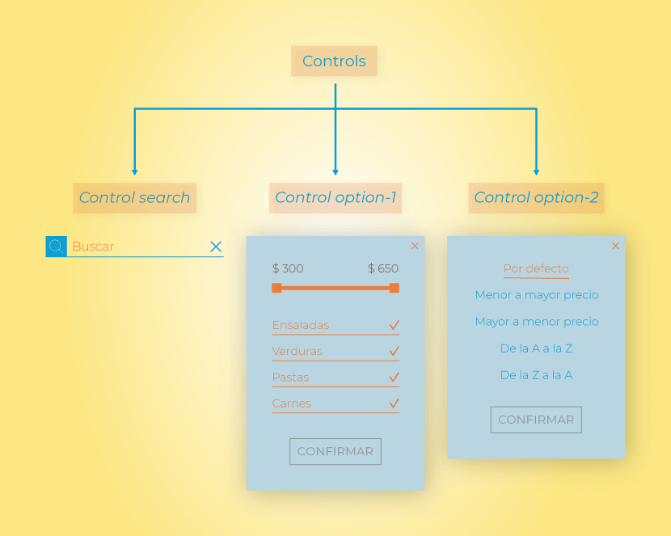
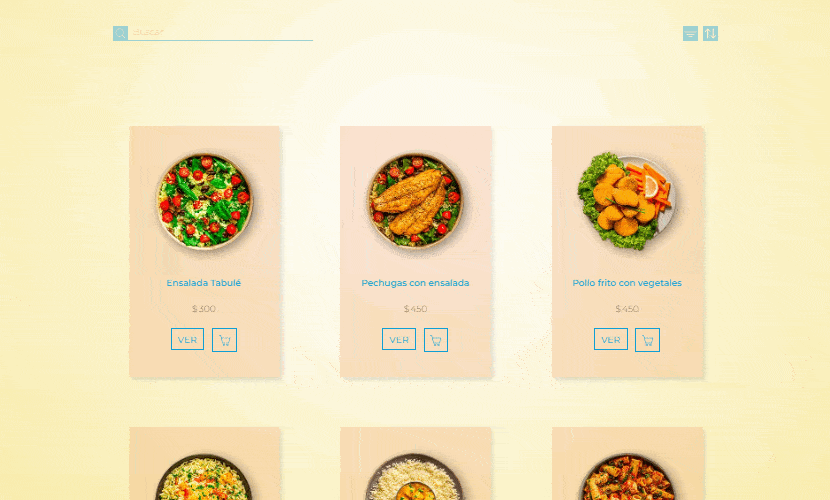
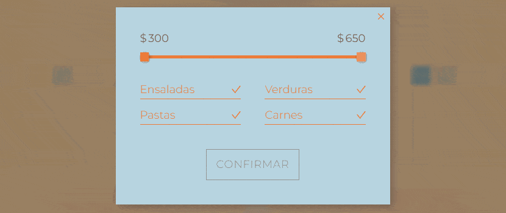

# Mi primer sitio con JavaScript: [Sauce | Restaurante de Tradición][index-page]

En el año 2021 comencé a dar mis primeros pasos en el mundo del desarrollo web aprendiendo las tecnologías y prácticas básicas para desarrollar sitios estáticos. Este proceso de aprendizaje se ve reflejado en lo que es mi [primer proyecto][mi-primer-sitio-repo]. Si no lo conocés, recomiendo que le eches una mirada, aunque sea rápida, para poder tener un mejor contexto de dónde es que viene y el por qué de este nuevo proyecto.

Este es una continuación de aquel primer sitio estático que tanto me ayudó a llevar a la práctica y afianzar los conocimientos de aquellas herramientas que iba estudiando. ¿Cuál es la diferencia? Como habrás notado en el título de esta introducción, ahora dicho sitio está desarrollado con funcionalidades dinámicas gracias a que en el transcurso del año 2022 tuve la oportunidad de comenzar a introducirme en el aprendizaje de JavaScript. Este proceso fue muy parecido al llevado a cabo en la realización de aquel primer proyecto.

Los recursos principales que utilicé para esta introducción a JavaScript fueron, con amplia diferencia, dos: [El tutorial de JavaScript Moderno][js-info] y [*MDN Web Docs*][MDN]. El primero fue una gran hoja de ruta que me guió a través de las múltiples partes fundamentales a incorporar en el proceso de aprendizaje de este lenguaje. A su vez, los contenidos me parecieron extremadamente pedagógicos y de una minuciosidad que no encontré en casi ningún otro recurso disponible para principiantes. Así es que me dio las herramientas necesarias para poder comenzar a entender y llevar a la práctica gran parte de sus características y funcionalidades principales. Por otro lado, el segundo me sirvió como una documentación mucho más técnica que me ayudó a completar el «mapa conceptual» del lenguaje en partes en las cuales [El tutorial de JavaScript Moderno][js-info] no ahondaba debido a su enfoque más pedagógico, recién mencionado, y no tan técnico al estilo documentación como sí lo es [*MDN Web Docs*][MDN].

En fin, en este trayecto comprendí que tenía la suerte haber desarrollado un primer proyecto lo suficientemente grande al cual podía dotarlo de muchísimas funcionalidades a través de JavaScript. Realmente las posibilidades son infinitas. Es así que aproveché esta base que es el proyecto «[Mi primer sitio][mi-primer-sitio-repo]» para refactorizarlo, convirtiéndolo en un sitio web dinámico en cuyo proceso iba a terminar de incorporar gran parte de las características que he ido aprendiendo este último año.

Ahora bien, ¿por qué un sitio web desarrollado con Vanilla JavaScript y no con una librería o *framework* de los que son usados actualmente? La raíz de esta decisión es la misma por la cual desarrollé un primer sitio totalmente estático: el objetivo principal fue estudiar, aprender y entender de la forma más consistente posible las bases del lenguaje de programación JavaScript y su estrecha interrelación con los navegadores web. Una vez comenzado a cumplir este objetivo (JavaScript es gigante, imposible abarcarlo todo en un proyecto de estudio como este) me adentraré en el aprendizaje de una librería o *framework* de desarrollo (muy probablemente [React JS][react]) para así poder dar un paso más en mi camino a convertirme en un desarrollador *front-end*.

A continuación voy a detallar algunas partes de este proyecto para que al momento de explorar el repositorio puedas tener un acercamiento más ameno a sus contenidos.

## Índice de contenidos
+ [Refactorización de componentes](#refactorización-de-componentes)
   + [Nutritional Info](#nutritional-info)
+ [Base de datos con la *API REST* de *My JSON Server*](#base-de-datos-con-la-api-rest-de-my-json-server)
   + [Funcionamiento](#funcionamiento)
   + [*Endpoints*](#endpoints)
   + [Rutas](#rutas)

## Refactorización de componentes

Como mencioné en la introducción, me encontré en la afortunada situación de tener un primer proyecto como base lo suficientemente grande que me daría la oportunidad de experimentar con él para poder aplicar múltiples funcionalidades a través de JavaScript. Sin embargo, esto no significa que tomé el código estructural del primer proyecto y simplemente le agregué unos cuantos archivos «.js» para dotarlo de dinamismo.

En su lugar, este proceso comenzó con el intento de refactorizar cada parte de aquella estructura propensa a ser mejorada. Esto lo realicé atendiendo a diferentes criterios que tuve la oportunidad de afianzar y comprender con mayor profundidad luego de un año más de estudio. Considero que en el primer proyecto estos criterios fueron, o bien logrados a medias o directamente desatendidos por mi falta de experiencia y práctica.

Alguno de los criterios principales a tener en cuenta en este nuevo proyecto fueron los relacionados a la escalabilidad, lograr una estructura más atomizada e independiente entre cada una de sus partes, ajustar la arquitectura de directorios de Sass a estas nuevas estructuras, corregir ciertas denominaciones de clases basadas en [BEM][bem] para conseguir manipular de forma más óptima el DOM, lograr un código HTML lo más limpio posible de clases innecesarias que dificulten su lectura y entendimiento, entre otros.

Obviamente, estos casos se dan en mayor o menor medida a lo largo de todo el proyecto, desde componentes extremadamente grandes y complejos heredados del primero y posteriormente atomizados e independizados de una forma más óptima en este, hasta otros que casi no necesitaron modificación alguna debido a que su estructura ya se encontraba lo suficientemente optimizada para ser utilizada. Si conocés el proyecto «[Mi primer sitio][mi-primer-sitio-repo]», seguramente al explorar los archivos HTML y CSS/Sass de este nuevo proyecto reconocerás más fácilmente estos cambios y mejoras enumeradas.

A modo de ejemplo, a continuación menciono un caso de refactorización que necesitó abarcar criterios tales como la escalabilidad, la previsibilidad de entrada de datos de gran longitud, adición de nuevas funcionalidades, mejores denominaciones de clases para su manejo tanto en CSS como en JavaScript, entre otros.

### [Nutritional Info][nutritional-info]

+ #### Adición de opciones de cantidad y unidades de peso personalizadas

  En el primer proyecto, el usuario solamente contaba con una información nutricional estática [cada 300 gramos de alimento][info-nutricional-static-grams]. En este nuevo desarrollo se le da la posibilidad de introducir una cantidad numérica personalizada además de poder elegir qué tipo de unidad de peso representa dicha cantidad. En esta instancia se contemplan tres tipos de unidades: gramos, kilogramos y platos (donde cada plato equivale a 300 gramos).
  
  Naturalmente, esta refactorización implicó un aumento de la complejidad del subcomponente [Main][nutritional-info-main] del [Nutritional Info][nutritional-info]. Aun así, se logró mantener su independencia, además de que se prevé un crecimiento futuro del proyecto pudiéndose agregar cuantas opciones de unidades de peso hagan falta, como se puede visualizar en los siguientes ejemplos.
  
  > Animación que muestra el subcomponente Main del Nutritional Info con las nuevas opciones disponibles para el usuario.

  
  
  > Animación que muestra la capacidad del subcomponente Main de albergar cuantas opciones de unidades de peso sean necesarias en caso de necesitar incorporar alguna nueva en el futuro.

  
  
+ #### Soporte para entrada de datos de gran longitud
  
  En el primer proyecto, al tratarse de un desarrollo estático y, por ende, teniendo cierta previsibilidad de los datos a ser presentados, cometí el error de no contemplar la posibilidad de que dichos datos fuesen extremadamente grandes. En consecuencia, esto rompería por completo el diseño y maquetación del componente.
  
  En esta ocasión, al haberle dado la posibilidad al usuario de que decida él mismo la extensión de los datos a ser presentados, me vi obligado a tener presente este escenario que en aquella ocasión fue ignorado. Es así que dichos errores fueron abordados y posteriormente arreglados, dándole la posibilidad al usuario de poder ingresar datos de una longitud arbitraria sin que eso signifique que el componente se vea afectado en su presentación.
  
  > Animación que muestra el componente [Nutritional Info][info-nutricional] en el proyecto «[Mi primer sitio][mi-primer-sitio-repo]» y cómo al forzar la longitud de los datos presentados, se rompe el diseño y la maquetación.
  
  
  
  > Animación que muestra el componente [Nutritional Info][nutritional-info] refactorizado y cómo al forzar la longitud de los datos presentados, el diseño y la maquetación se mantienen.

  
  
   Obviamente, es muy difícil que el usuario tenga un interés genuino en ingresar una cantidad de, por ejemplo, kilogramos tan grande que genere un recuento de calorías y gramos tal que desborde sus contenedores. Aun así, es un caso del que hay que estar prevenido y tratar de manejarlo para evitar errores y renderizados defectuosos.
   
+ #### Posibilidad de ampliar los «ratios» necesarios

  Nuevamente, en el primer proyecto ignoré el escenario en donde el sitio necesitase crecer y en ese proceso ampliar la información de «ratios» que les son presentados al usuario. Al igual que con el soporte para entrada de datos de gran longitud, en esta ocasión dicha posibilidad fue contemplada y posteriormente arreglada, dándole la posibilidad al proyecto de que en un futuro pueda extender estas informaciones sin que el diseño y maquetación del subcomponente [Details][nutritional-info-details] se vea afectada.
  
  > Animación que muestra el subcomponente [Details][info-nutricional-details] en el proyecto «[Mi primer sitio][mi-primer-sitio-repo]» y cómo al ampliar la información de «ratios» presentados al usuario, se rompe el diseño y la maquetación.
  
  
  
  > Animación que muestra el subcomponente [Details][nutritional-info-details] refactorizado y cómo al ampliar la información de «ratios» presentados al usuario, el diseño y la maquetación se mantienen.
  
  
  
## Base de datos con la *API REST* de [*My JSON Server*][json-server]
   
   Como es de esperarse en un sitio construido, al menos en parte, con JavaScript, busqué obtener de forma dinámica los datos de los platos con los que el usuario va a interactuar.
  
   Ya no existe un documento [menu.html][mi-primer-sitio-menu] en el que se encuentra un listado de todos los platos establecidos de antemano. En su lugar, ahora hay un documento [menu.html][menu] que trae los datos desde una base simulada y posteriormente los renderiza según los requerimientos del usuario. Lo mismo ocurre con los documentos individuales de cada plato. En realidad, ya no existen tales documentos preestablecidos en un servidor esperando a ser entregados a un navegador que los solicite. Ahora todos son manejados desde un único documento [plate.html][plate], que junto a su código JavaScript va renderizando diferentes platos dependiendo de las acciones del usuario. Se podría decir que tiene la misma lógica de funcionamiento que una [*SPA*][spa] dentro del sitio general, ya que una vez en este documento, jamás se realiza una recarga general para volver a renderizar tal o cual plato. En su lugar, solo se actualizan los componentes necesarios para mostrarle al usuario los datos correctos.
   
   Para poder concretar estos requerimientos sin aún poseer conocimientos en la construcción de una base de datos y la programación de su *API*, me apoyé en la herramienta [*My JSON Server*][json-server]. La elegí porque su uso básico es simple y cubría dichos requerimientos de forma exitosa. Esto me liberó de la tarea de aprender a las apuradas alguna otra herramienta un tanto más compleja para poder cubrir las necesidades del proyecto, desviándome así del objetivo principal que era enfocarme en JavaScript y su interacción con el navegador para renderizar de forma correcta la interfaz de usuario.
   
   ### Funcionamiento
   
   En la raíz del proyecto tuve que crear un JSON llamado [db.json][db]. En su versión *free*, la cual utilicé, este archivo no debe superar los 10 KB de peso. Es por eso que existen dos tipos de archivos, uno es este y el otro es [db-expand.json][db-expand]. El primero es al que se hacen las solicitudes reales y el único al que la herramienta [*My JSON Server*][json-server] reconoce. Este archivo tiene la particularidad de estar minificado con el objetivo de no superar dicho límite de peso. El segundo existe solamente con el propósito de ser legible para humanos, conteniendo exactamente los mismos datos que [db.json][db], pero que lamentablemente supera el límite impidiendo que esta herramienta funcione correctamente con él.
   
   Una vez creado el archivo [db.json][db], solo resta realizar solicitudes a la URL https://my-json-server.typicode.com seguida del nombre de usuario de GitHub, el nombre del repositorio y, opcionalmente, el [*endpoint*](#endpoints) al cual acceder. Este manejo básico de la URL y sus rutas fue centralizado en el *helper* llamado [api.js][api]. Luego, los archivos que necesiten realizar alguna solicitud a la *API* solo deben importar la URL a la que quieran acceder desde dicho recurso e invocarla. Cabe aclarar que la *API* soporta los métodos [GET][get], [POST][post], [PUT][put], [PATCH][patch] y [DELETE][delete], aunque en el desarrollo de este proyecto necesité utilizar únicamente el método [GET][get].
   
   ### *Endpoints*
   
   +  #### [plates][db-expand-plates]
   
      > Fragmento del [db-expand.json][db-expand] que ejemplifica el *endpoint* `plates` conteniendo el objeto cuyos datos corresponden al primer plato.
   
      ```json
      {
         "plates": [
            {
               "id": 1,
               "name": "Ensalada Tabulé",
               "price": 300,
               "categories": ["salads", "vegetables"],
               "imageId": 1,
               "description": "Se trata de una ensalada hecha con trigo burgol..."
            }
         ]
      }
      ```
      
      +  `id`: identificador único del plato.
      +  `name`: nombre del plato.
      +  `price`: precio del plato.
      +  `categories`: categorías en las cuales se puede clasificar el plato.
      +  `imageId`: identificador para llamar al directorio correcto de imágenes.
      +  `description`: breve descripción del plato.
      
   +  #### [nutritionalInfo][db-expand-nutritional-info]
      
      > Fragmento del [db-expand.json][db-expand] que ejemplifica el *endpoint* `nutritionalInfo` conteniendo el objeto cuyos datos corresponden al primer plato.
         
      ```json
      {
         "nutritionalInfo": [
            {
               "id": 1,
               "plateId": 1,
               "kcals": 1.277,
               "fats": {
                  "total": 0.0962,
                  "saturated": 0.0134,
                  "polyunsaturated": 0.0108,
                  "monounsaturated": 0.06801
               },
               "carbohydrates": {
                  "total": 0.1023,
                  "sugar": 0.0138,
                  "fiber": 0.0236
               },
               "proteins": {
                  "total": 0.0169
               }
           }
         ]
      }
      ```
      
      +  `id`: identificador único de la información nutricional.
      +  `plateId`: identificador que asocia la información nutricional con el plato del *endpoint* [plates](#plates) que posea el mismo identificador (obligatorio de [*My JSON Server*][json-server]).
      +  `kcals`: valor de calorías por gramo de alimento.
      +  `fats`: valores de gramos de grasas totales y específicas por gramo de alimento.
      +  `carbohydrates`: valores de gramos de carbohidratos totales y específicos por gramo de alimento.
      +  `proteins`: valor de gramos de proteínas totales por gramo de alimento
      
   ### [Rutas][json-server-routes]
   
   Por último, esta herramienta da la posibilidad de realizar solicitudes a través de una URL cuya ruta contenga una serie de parámetros de búsqueda personalizados para poder obtener recursos, por ejemplo, paginados, que superen ciertos filtros o bien para embeber informaciones asociadas a esos recursos, tales como la [nutritionalInfo](#nutritionalinfo) de los [plates](#plates).
   
   En el resumen del proceso de desarrollo de [Menu](#menu) y [Plate](#plate) se puede encontrar el modo de uso de estos tipos de parámetros para personalizar la experiencia del usuario que interactúe con el sitio. A modo de mención, algunos de los parámetros más utilizados que la *API* proporciona son: [*paginate*][json-server-paginate], [*sort*][json-server-sort], [*operators*][json-server-operators], [*full text search*][json-server-full-text-search] y [*relationships*][json-server-relationships].
   
   
## [JavaScript][javascript]

   ### [Menu][index-menu-js]
   
   Como mencioné con anterioridad, el documento [menu.html][menu] fue reestructurado de manera tal que el listado de platos presentados al usuario se construye dinámicamente en base a ciertos parámetros. En esta reestructuración hay tres partes fundamentales que trabajan en conjunto para poder llevar a cabo este propósito: la sección [Controls](#controls), la sección [Cards](#cards) y la ya expuesta [base de datos](#base-de-datos-con-la-api-rest-de-my-json-server). Es así que en conjunto, estas secciones del código le permiten al usuario disponer de una variedad de platos ajustados a sus necesidades y gustos, según sea la ocasión.
   
   A continuación se expondrá el contenido y lógica de funcionamiento de estas secciones para que al momento de explorar el [directorio JavaScript del Menu][index-menu-dir] puedas contar con una guía explicativa y visual que te ayude a comprenderlo mejor.
   
   #### [Controls][controls-js]
   
   > Imagen que grafica la sección Controls y sus contenidos

  
   
   Dentro de esta sección se encuentran las herramientas que se le brindan al usuario para que pueda personalizar los platos a ser presentados.
   
   La clase [Controls][controls-class] es la encargada de centralizar toda la actividad, alojando las interfaces que representan a cada *Control* particular y manejando el establecimiento y actualización de los parámetros de búsqueda y sus valores en base a la configuración inicial y los cambios efectuados en cada *Control*.
   
   ```mermaid
   classDiagram
    direction LR
    class Controls {
        params
        setParams()
        setURLParams()
        getParamNames()
        getParamPrefixes()
    }

    Controls --> Search : contiene
    Controls --> OptionControl : contiene
   ```
   
   Es decir, en su capa esencial, la lógica de esta sección es establecer en la inicialización los parámetros de búsqueda y sus respectivos valores y luego ir actualizándolos cada vez que algún *Control* dentro de ella sufra un cambio que requiera que dichos valores deban ser actualizados. Posteriormente, estos parámetros y sus valores permanecerán disponibles para ser utilizados en la sección [Cards](#cards) al momento de realizar una solicitud personalizada a la [base de datos][db].
   
   ##### Inicialización y actualización de parámetros
   
   Para que un *Control* dentro de esta sección funcione correctamente, en su código HTML debe contener obligatoriamente el atributo personalizado `data-params`. Este atributo contendrá uno o más nombres de parámetros de búsqueda separados por un punto y coma (`;`), que serán los parámetros a los cuales ese *Control* representará.
   
   Debido a que estos parámetros pueden llegar a tener algún tipo de prefijo, como por ejemplo un nombre de propiedad al cual dicho parámetro debe ser vinculado para que la *API* realice su trabajo correctamente, opcionalmente su código HTML puede contener el atributo personalizado `data-param-prefixes`.
   
   Este debe contener el mismo número de prefijos por cantidad de nombres de parámetros que contenga el atributo `data-params`. Esto es, si `data-params` contiene los parámetros `"_foo;_bar;_baz"`, de contener prefijos, el atributo `data-param-prefixes` debería ser algo como `"propA;propA;propB"`. El orden importa, cada prefijo debe tener la misma ubicación en la lista que el que tiene el nombre de parámetro a ser asociado en la suya; y si hubiese un nombre de prefijo repetido, debe ser duplicado para que al momento de establecer los parámetros todo funcione correctamente. 
   
   > Ejemplo de cómo se verían establecidos los parámetros junto a sus prefijos y valores luego de la inicialización
   ```javascript
   console.log(Controls.params); // { propA_foo: value, propA_bar: value, propB_baz: value  }
   ```
   
   Entonces, al momento de la inicialización, todas las interfaces que representan a un *Control* específico ([Search][search-class], [From][from-class], [To][to-class], [Filter][filter-class], [Sort][sort-class]), obtienen de su código HTML los nombres de los parámetros a los cuales representa, los almacena y luego establece sus valores llamando a dos métodos de la clase controladora principal [Controls][controls-class]: `getParamNames` y `setParams`. Así, quedarán disponibles para ser enviados en la URL al momento de realizar una petición a la [base de datos](#base-de-datos-con-la-api-rest-de-my-json-server).
   
   Luego, solo resta esperar a que haya una modificación en algún *Control* que obligue a actualizar los valores de sus parámetros para que simplemente su interfaz llame a `setParams` y dicha actualización se realice. Cabe remarcar que esta situación se da en dos ocaciones:
   
   +  Cuando a través de las acciones del usuario se produce un cambio o confirmación de cambio. Se comunica a su interfaz por medio de los eventos `change` o `update-last-values-confirmed`.
   
   +  Cuando se fuerza un restablecimiento a los valores por defecto. Se comunica a su interfaz por medio del evento `default-values`.


   ##### [Search][search-js]
   
   > Animación que muestra el comportamiento del componente *Search*

   
   
   El módulo [Search.js][search-js] es el encargado de manejar todo lo relacionado a este componente. En él se establecen las validaciones necesarias para personalizar su comportamiento a través de JavaScript, tales como limitaciones de tipos de caracteres y espaciados. Esto asegura que el valor enviado posteriormente junto con la URL hacia la *API*, sea un valor correcto que no genere errores ni defectos en la búsqueda por estar construido con caracteres erróneos.
   
   El parámetro que le permite a estos valores viajar hacia la [base de datos](#base-de-datos-con-la-api-rest-de-my-json-server) para traer platos específicos es el de [*full text search*][json-server-full-text-search]. Esta herramienta que brinda la *API* simplemente busca en todas las propiedades de todos los objetos de datos del [*endpoint* `plates`](#plates) un texto que coincida con este valor. Así, por ejemplo, el usuario puede buscar un ingrediente específico que desea encontrar en los platos del menú y este no necesariamente debe estar en el nombre del plato para ser seleccionado. En su lugar, puede ser parte de la descripción u otra propiedad actual (tal como `categories`) o futura que sea agregada en siguientes actualizaciones del sitio.
   
   Para hacer todo esto posible, [Search][search-class] almacena en memoria el último valor introducido por el usuario y lo va actualizando a medida que se van produciendo cambios «definitivos» (a través del evento `change` en vez de `input`) que varíen de aquel último valor almacenado. Una vez actualizado este, se encarga de comunicarle a la sección [Cards](#cards), por medio de un evento personalizado, que debe realizar un nuevo renderizado de los platos presentados debido a que los parámetros bajo los cuales se mostraban los anteriores han sido modificados.
   
   ##### [Option][option-js]
   
   Como se puede ver en la imagen al inicio de esta [sección](#controls), un *Option* no es más que un contenedor de varios subcomponentes que actúan como filtros independientes y que están agrupados en él.
   
   En este primer desarrollo con JavaScript existen dos *Options*: el [*option-1*][option-1] y el [*option-2*][option-2]. Ambos le proveen herramientas al usuario para que pueda ajustar aún más sus preferencias y así poder dar con los platos que le interesan.
   
   La clase [OptionControl][option-class] es la encargada de centralizar toda la actividad relacionada a estos contenedores y sus filtros. Desde el manejo de su visualización u ocultamiento, pasando por las interfaces que gestionan cada *Control* particular, hasta la confirmación de cambios que desencadenarán nuevas peticiones y renderizados en la sección [Cards](#cards).
   
   ```mermaid
      classDiagram
         direction TB
         OptionControl --> Modal : contiene
         OptionControl --> Input : contiene
         OptionControl --> List : contiene
         OptionControl --> Confirm : contiene
   ```
   
   * [Modal][modal-js]
   
      Esta interfaz se encarga de todo lo relacionado al manejo de la visualización y ocultamiento de los *Options*. Para ello, escucha los eventos necesarios que desencadenarán estos escenarios luego de alguna acción específica del usuario. Si esta lo amerita, delegará su manejo a una de las dos interfaces inicializadas en su interior y destinadas al control de dichos escenarios: [Show][show-class] o [Hide][hide-class].
      
      > Animación que muestra la visualización y posterior ocultamiento de un *Option*. Notar que por debajo del *breakpoint large* (992 píxeles) deja de comportarse como un *dropdown* y se convierte en un *modal* en sí.

      
      
      Las acciones del usuario que desencadenarán la visualización de un *Option* son:
      
      *  `click` o `keydown` con `key = Enter` en un botón [*show*][show-button], mientras el *Option* vinculado a ese botón esté oculto.
      
      Las acciones del usuario que descadenarán el ocultamiento de un *Option* son:     
      
      *  `click` en un botón [*hide*][hide-button].
      *  `click` en un [*modal*][modal-container] (cuando se comporte como tal, por debajo de los 992 píxeles).
      *  `click` en cualquier parte fuera de un *Option* visualizándose (cuando se comporte como un *dropdown*, por encima de los 992 píxeles).
      *  `click` o `keydown` con `key = Enter` en un botón [*show*][show-button], mientras haya un *Option* visualizándose.
      *  `keydown` con `key = Escape`, mientras haya un *Option* visualizándose.
      
   * [Input][input-js]
      
      Esta interfaz está destinada a centralizar el manejo de todos los filtros que se encuentren en el nivel superior de un *Option*. Como se puede ver en el siguiente diagrama, en este primer desarrollo con JavaScript se encuentra disponible un solo filtro de nivel superior: el [Range][range-js] del [*option-1*][option-1].
      
      ```mermaid
         classDiagram
            direction LR
            Input --> Range : contiene
      ```
      
      *  [Range][range-js]
      
         > Animación que muestra el comportamiento del componente *Range*

         
         
         En el desarrollo de esta funcionalidad me encontré con que no existía una forma nativa en HTML de construir un doble rango. Esto me dio la oportunidad de poder crear una solución alternativa que me ayudó a ponerme a prueba y desarrollar algo un poco más complejo.
         
         Aunque no lo hice solo. En el proceso de investigación descubrí que había unos cuantos caminos válidos para llegar al mismo resultado. En este caso, me basé en un método que se puede encontrar en este [artículo de *Medium*][medium-range]. Opté usar como base lo expuesto en dicho artículo ya que era la solución que mejor se adaptaba a las necesidades específicas de este componente dentro de lo que es la estructura del proyecto.
         
         Su estructura y funcionamiento son relativamente simples. Se trata de dos elementos HTML `<input>` de tipo `range` que son estilizados mediante [CSS][range-sass] de manera tal que visualmente se comportan como un solo rango al que se puede configurar desde sus dos extremos. Luego, a través de JavaScript, mediante los módulos que se pueden encontrar en el directorio [/range][range-dir], se ajusta su comportamiento para poder tener un doble rango funcional que actúa de la forma prevista para un componente de este tipo.
         
         ```mermaid
            classDiagram
               direction LR
               Range --> From : contiene
               Range --> To : contiene

               Range --|> InputAbstract : hereda
    
               From --|> RangeAbstract : hereda
               To --|> RangeAbstract : hereda

               <<Abstract>> InputAbstract
               <<Abstract>> RangeAbstract
         ```
         
         La clase [Range][range-class] es la encargada de centralizar toda la actividad. Hereda de [InputAbstract][input-abs-class], que es, como su nombre lo indica, una interfaz abstracta que sirve como base para todos los *Inputs* que se encuentren dentro de un *Option*. Esto es, ya sea en el nivel superior o en otro nivel dentro de este. 
         
         Esta, a su vez, contiene las interfaces [From][from-class] y [To][to-class] que representan a cada uno de los dos rangos que existen en la estructura. [From][from-class] maneja el control izquierdo, mientras que [To][to-class] se encarga de manejar el control derecho. Estas dos interfaces heredan de [RangeAbstract][range-abs-class], la cual es, al igual que [InputAbstract][input-abs-class], una interfaz abstracta que sirve como base para todos los rangos ([From][from-class], [To][to-class] y cualquier otro que pudiese ser incorporado en el futuro). 
      
         Por último, los parámetros que le permiten a los valores de cada control del rango viajar hacia la [base de datos](#base-de-datos-con-la-api-rest-de-my-json-server) para traer platos específicos son los [operadores de rango][json-server-operators]. Esta herramienta que brinda la *API* nos da la posibilidad de establecer dos tipos de parámetros:
         
         * `_gte`: *greater than or equal* (mayor o igual que). Contendrá el valor del control izquierdo manejado por [From][from-class].
         * `_lte`: *less than or equal* (menor o igual que). Contendrá el valor del control derecho manejado por [To][to-class].

         Además, para que la *API* sepa qué propiedad debe someter al filtro de estos rangos, se debe colocar como prefijo su nombre. En este caso, la propiedad `price` del [*endpoint* `plates`](#plates) es la que será puesta a prueba para saber si un plato específico supera o no el filtro. Por lo tanto, los parámetros finales que se envían a la [base de datos](#base-de-datos-con-la-api-rest-de-my-json-server) con sus respectivos valores son: `price_gte` y `price_lte`.
         
   * [List][list-js]
      
      Esta interfaz se encarga de todo lo relacionado al manejo de las listas que se encuentran dentro de un *Option*, desde sus etiquetas e ítems hasta los filtros que se hallen en el interior de estos.
      
      Para ello, inicializa las interfaces [Label][label-class], [Item][item-class] e [InputList][input-list-class]. Las dos primeras son muy simples. Ofrecen funcionalidades y características que permitern manejar en otras partes del código ciertas situaciones de interacción que involucran tanto a las etiquetas como a los ítems. En cuanto a la tercera, merece un desarrollo aparte ya que cumple una función central en el manejo de los filtros que se encuentran en las listas.
      
      * [InputList][input-list-js]
      
         Esta interfaz cumple exactamente el mismo rol que la interfaz [Input][input-js] descripta con anterioridad. La diferencia es que mientras esta última está destinada a centralizar el manejo de todos los filtros que se encuentren en el nivel superior, [InputList][input-list-class] lo está para los filtros que se encuentren en el nivel interior de las listas presentes en un *Option*.
         
         Como se puede ver en el siguiente diagrama, en este primer desarrollo con JavaScript se encuentran disponibles dos filtros a nivel de lista: el [Filter][filter-js] y el [Sort][sort-js].
      
      ```mermaid
         classDiagram
            direction LR
            InputList --> Filter : contiene
            InputList --> Sort : contiene
      ```
      
      *  [Filter][filter-js] y [Sort][sort-js]
      
         > Animación que muestra el comportamiento del componente *Filter*

         
         
         > Animación que muestra el comportamiento del componente *Sort*

         
         
         La estructura y funcionamiento de estos filtros son simples. Se trata de elementos HTML `<input>` de tipo `checkbox` y `radio` respectivamente, ubicados dentro de los ítems de una lista con sus etiquetas asociadas. A través de JavaScript, mediante los módulos [Filter.js][filter-js] y [Sort.js], se controlan sus comportamientos de manera tal que los valores seleccionados por el usuario se mantienen almacenados en memoria y son actualizados a medida que se van dando cambios «parciales» (antes de una *confirmación*) o «definitivos» (con una *confirmación*).
         
         Además de este almacenamiento y actualización constante, dichos módulos se encargan de manejar ciertos eventos originados por algunas interacciones del usuario que requieran forzar ciertos valores para que su experiencia sea la más óptima posible.
         
         ```mermaid
            classDiagram
               direction LR
               Filter --|> InputListAbstract : hereda
               InputListAbstract --|> InputAbstract : hereda

               <<Abstract>> InputListAbstract
               <<Abstract>> InputAbstract
         ```
         
      
      

   
      
      
   
   
   
   
   
   
   
   
   
   


[index-page]: https://rodrigodomingorena.github.io/mi-primer-sitio-con-js/

[menu]: ./pages/menu.html
[controls-section]: ./pages/menu.html#L127
[option-1]: ./pages/menu.html#L152
[option-2]: ./pages/menu.html#L287
[cards-section]: ./pages/menu.html#L415

[plate]: ./pages/plate.html

[db]: ./db.json
[db-expand]: ./db-expand.json
[db-expand-plates]: ./db-expand.json#L2
[db-expand-nutritional-info]: ./db-expand.json#L165
[api]: ./assets/js/helpers/api.js

[javascript]: ./assets/js

[index-menu-dir]: ./assets/js/index-menu
[index-menu-js]: ./assets/js/index-menu.js
[controls-js]: ./assets/js/index-menu/menu/controls/Controls.js
[controls-class]: ./assets/js/index-menu/menu/controls/Controls.js#L7
[search-js]: ./assets/js/index-menu/menu/controls/search/Search.js
[search-class]: ./assets/js/index-menu/menu/controls/search/Search.js#L4
[option-js]: ./assets/js/index-menu/menu/controls/option/Option.js
[option-class]: ./assets/js/index-menu/menu/controls/option/Option.js#L9
[modal-js]: ./assets/js/index-menu/menu/controls/option/modal/Modal.js
[modal-class]: ./assets/js/index-menu/menu/controls/option/modal/Modal.js#L7
[modal-container]: ./pages/menu.html#L164
[show-js]: ./assets/js/index-menu/menu/controls/option/modal/show/Show.js
[show-class]: ./assets/js/index-menu/menu/controls/option/modal/show/Show.js#L4
[show-button]: ./pages/menu.html#L154
[hide-js]: ./assets/js/index-menu/menu/controls/option/modal/hide/Hide.js
[hide-class]: ./assets/js/index-menu/menu/controls/option/modal/hide/Hide.js#L4
[hide-button]: ./pages/menu.html#L276
[input-js]: ./assets/js/index-menu/menu/controls/option/input/Input.js
[input-class]: ./assets/js/index-menu/menu/controls/option/input/Input.js#L6
[input-abs-class]: ./assets/js/index-menu/menu/controls/option/input/abstract/Input-Abstract.js#L4
[range-dir]: ./assets/js/index-menu/menu/controls/option/input/range/
[range-js]: ./assets/js/index-menu/menu/controls/option/input/range/Range.js
[range-class]: ./assets/js/index-menu/menu/controls/option/input/range/Range.js#L14
[range-sass]: ./assets/style/scss/components/control/_controls.scss#L352
[range-abs-class]: ./assets/js/index-menu/menu/controls/option/input/range/abstract/Range-Abstract.js#L4
[from-class]: ./assets/js/index-menu/menu/controls/option/input/range/from/From.js#L6
[to-class]: ./assets/js/index-menu/menu/controls/option/input/range/to/To.js#L6
[list-js]: ./assets/js/index-menu/menu/controls/option/list/List.js
[list-class]: ./assets/js/index-menu/menu/controls/option/list/List.js#L8
[label-class]: ./assets/js/index-menu/menu/controls/option/list/label/Label.js#L4
[item-class]: ./assets/js/index-menu/menu/controls/option/list/item/Item.js#L4
[input-list-js]: ./assets/js/index-menu/menu/controls/option/list/input/Input-List.js
[input-list-class]: ./assets/js/index-menu/menu/controls/option/list/input/Input-List.js#L7
[filter-js]: ./assets/js/index-menu/menu/controls/option/list/input/filter/Filter.js
[filter-class]: ./assets/js/index-menu/menu/controls/option/list/input/filter/Filter.js#L6
[sort-js]: ./assets/js/index-menu/menu/controls/option/list/input/sort/Sort.js
[sort-class]: ./assets/js/index-menu/menu/controls/option/list/input/sort/Sort.js#L6

[nutritional-info]: ./pages/plate.html#L179
[nutritional-info-main]: ./pages/plate.html#L182
[nutritional-info-details]: ./pages/plate.html#L237

[mi-primer-sitio-repo]: https://github.com/rodrigodomingorena/mi-primer-sitio
[mi-primer-sitio-menu]: https://github.com/rodrigodomingorena/mi-primer-sitio/blob/master/pages/menu.html

[info-nutricional]: https://github.com/rodrigodomingorena/mi-primer-sitio/blob/master/pages/plato-1.html#L165
[info-nutricional-static-grams]: https://github.com/rodrigodomingorena/mi-primer-sitio/blob/master/pages/plato-1.html#L175
[info-nutricional-details]: https://github.com/rodrigodomingorena/mi-primer-sitio/blob/master/pages/plato-1.html#L178

[json-server]: https://github.com/typicode/json-server
[json-server-routes]: https://github.com/typicode/json-server#routes
[json-server-paginate]: https://github.com/typicode/json-server#paginate
[json-server-sort]: https://github.com/typicode/json-server#sort
[json-server-operators]: https://github.com/typicode/json-server#operators
[json-server-full-text-search]: https://github.com/typicode/json-server#full-text-search
[json-server-relationships]: https://github.com/typicode/json-server#relationships


[js-info]: https://es.javascript.info/
[mdn]: https://developer.mozilla.org/en-US/
[react]: https://beta.reactjs.org/
[bem]: https://github.com/rodrigodomingorena/mi-primer-sitio#metodolog%C3%ADa-bem
[spa]: https://developer.mozilla.org/en-US/docs/Glossary/SPA
[medium-range]: https://medium.com/@predragdavidovic10/native-dual-range-slider-html-css-javascript-91e778134816

[get]: https://developer.mozilla.org/en-US/docs/Web/HTTP/Methods/GET
[post]: https://developer.mozilla.org/en-US/docs/Web/HTTP/Methods/POST
[put]: https://developer.mozilla.org/en-US/docs/Web/HTTP/Methods/PUT
[patch]: https://developer.mozilla.org/en-US/docs/Web/HTTP/Methods/PATCH
[delete]: https://developer.mozilla.org/en-US/docs/Web/HTTP/Methods/DELETE
